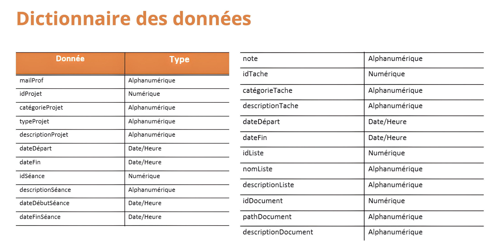
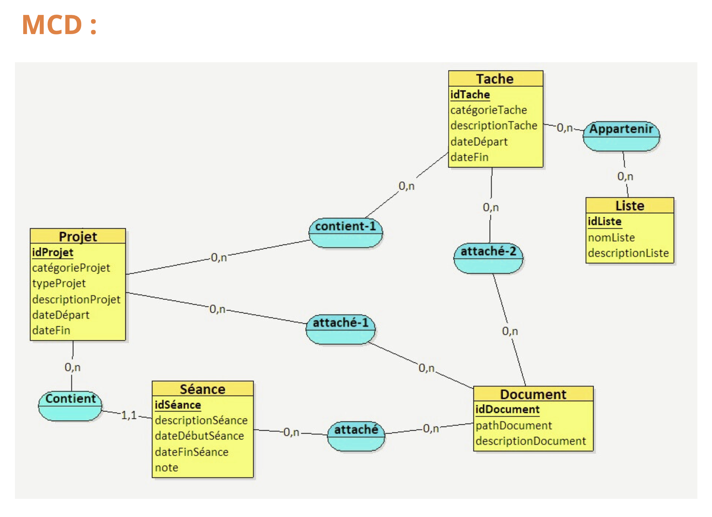

# ProManager - Gérez facilement vos tâches et projets

Le projet vise à élaborer une application Java destinée à faciliter la gestion des projets et des tâches académiques d'un professeur. L'application fournira des fonctionnalités exhaustives pour aider le professeur à organiser ses activités d'enseignement, de recherche, et d'encadrement, tout en optimisant le suivi des séances et des tâches liées. La complexité des responsabilités d'un professeur, englobant l'enseignement, l'encadrement de projets et de thèses, nécessite une solution numérique pour une gestion efficace. Le besoin émerge de centraliser les informations, d'optimiser la planification, et de fournir une visibilité accrue sur les activités académiques.

## Objectifs du Projet :

- Développer une application Desktop intuitive et ergonomique, accessible depuis n'importe quel appareil.
- Offrir une plateforme centralisée pour la gestion des projets académiques, des tâches à accomplir et des séances de travail.
- Faciliter le suivi des activités académiques, telles que les cours, les projets de fin d'études, les thèses de doctorat, etc.
- Permettre une organisation efficace des projets et tâches, en offrant des fonctionnalités de filtrage, de recherche et de gestion avancée. 
- Fournir des statistiques et des rapports détaillés sur l'avancement des projets, le temps de travail, les documents associés, etc.

## Fonctionnalités Principales :

- Gestion des Projets et Tâches : Permettre aux professeurs de créer, modifier, supprimer et clôturer des projets, ainsi que d'ajouter, supprimer et modifier des tâches associées à ces projets.
- Gestion des Séances de Travail : Permettre aux professeurs de planifier, ajouter, modifier et supprimer des séances de travail, avec la possibilité d'attacher des notes écrites et des documents. Gestion des Documents : Permettre d'attacher des documents aux projets, aux tâches et aux séances de travail, avec la possibilité de les consulter, ajouter,modifier et supprimer.
- Fonctionnalités de Recherche : Permettre aux professeurs de rechercher des projets, des tâches et des documents par mots-clés, catégorie, type, état, date, etc.
- Statistiques et Rapports : Fournir des statistiques détaillées sur le temps de travail, les documents associés, les projets clôturés, etc.
- Intégration Google Calendar : Permettre d'importer des tâches et des séances de travail depuis Google Calendar, et d'attribuer ces éléments à des projets existants.
- Authentification Google : Permettre aux professeurs de se connecter à l'application à l'aide de leur compte Google pour une expérience utilisateur simplifiée.

[View the PDF](images/GuideProManager.pdf)

